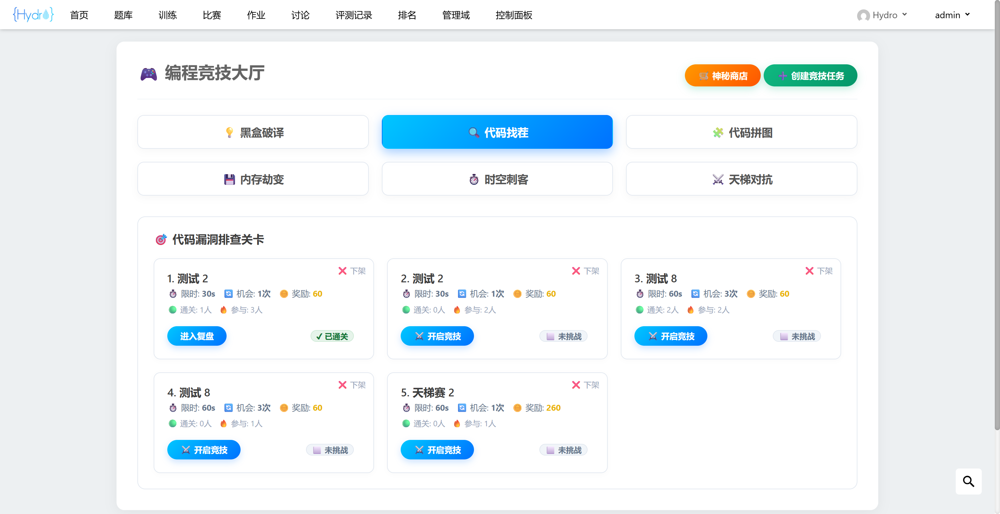
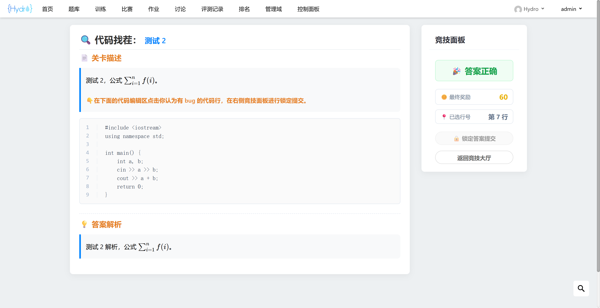
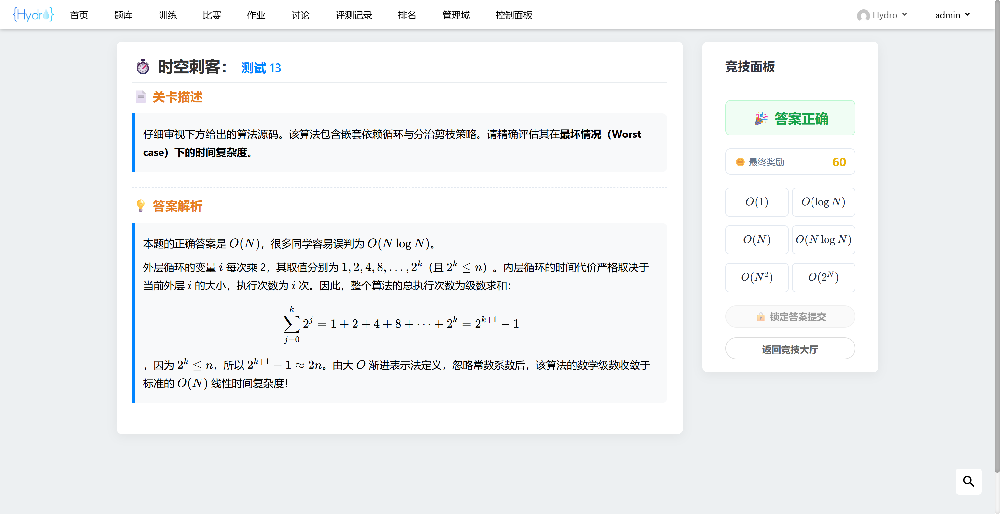
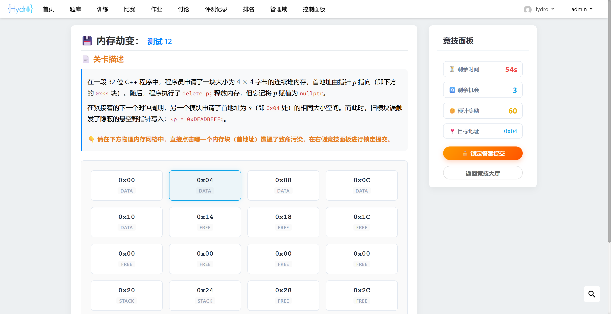
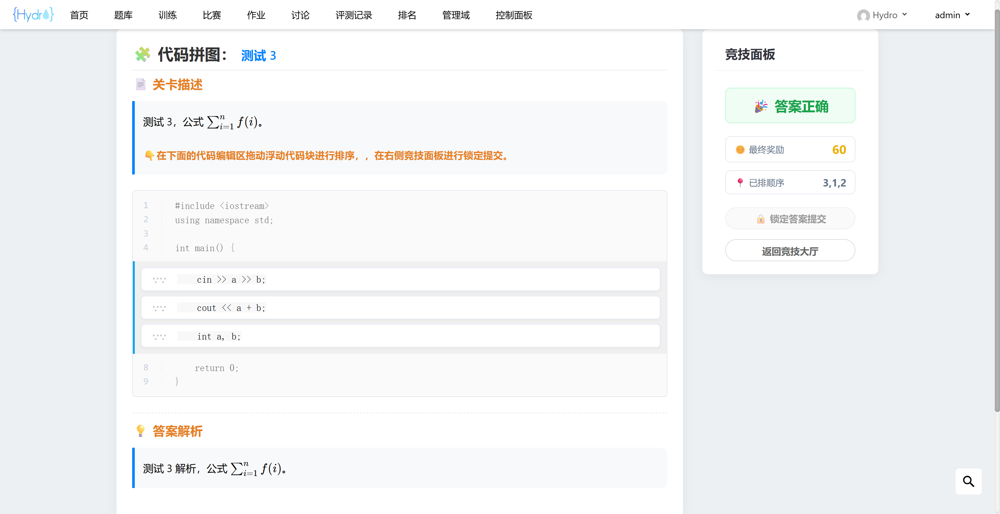
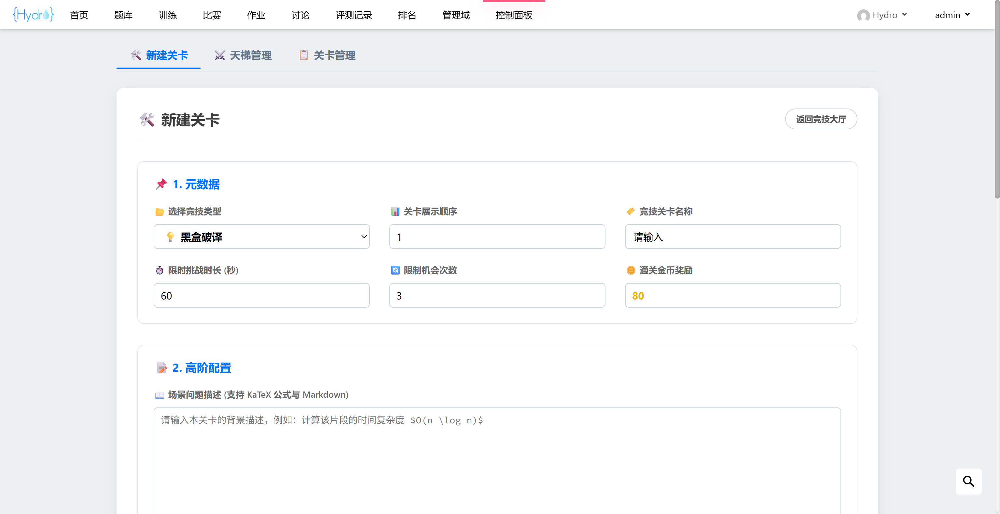
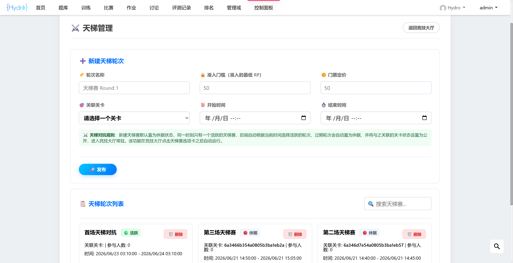
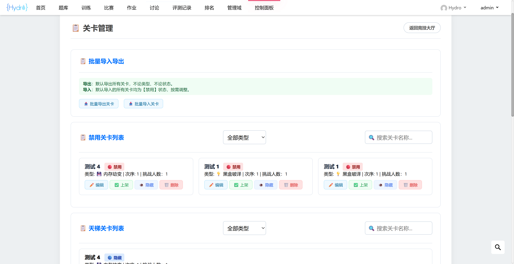

# Hydro 编程竞技插件

兼容 V5.0.1 社区版，依赖于 `hydro-coin` 插件，不依赖第三方库，安装方法见官方文档。该竞技平台设置了五种竞技游戏：
1. 黑盒破译：根据线索猜测正确算法名称，参考 dtoj 黑盒破译器玩法。
2. 代码找茬：根据题目描述，找出代码中唯一存在 bug 的代码行，参考 dtoj 代码来找茬玩法。
3. 代码拼图：根据题目描述，拖动代码行进行排序，参考 dtoj 代码拼图玩法。
4. 内存劫变：根据题目描述，找出存在内存泄漏、越界风险的内存首地址。
5. 时空刺客：根据题目描述，分析代码 / 算法的时间 / 空间复杂度。

此外还设置了天梯对抗赛的联动玩法，配置好天梯赛之后，插件会在加载天梯对抗时自动选取当前活跃的轮次，如果不存在则为空。天梯赛过期之后会将关联关卡自动置为启用（大厅常驻），如果不想启用关卡，可以在天梯赛过期后手动禁用或隐藏。暂时没有内置关卡内容，后期计划内置 30 个关卡，每种类型下 5 个关卡，更多关卡为有偿购买，感兴趣请联系微信：17723611532。

`/img` 中是 `README.md` 的截图，安装时可以放心删除。

## 普通用户功能

1. 可以参与常驻公开关卡的挑战，挑战通过后即可获得相应奖励。
2. 在满足 RP 要求，且金币余额足够购买门票的情况下，可以参与天梯对抗玩法，获取高额奖励。

## 管理员功能

拥有 `PRIV_MANAGE_ALL_DOMAIN` 权限的用户为管理员用户。

1. 可以创建、修改、公开（大厅常驻）、隐藏（天梯赛专用）、禁用、删除关卡。
2. 可以创建、删除天梯对抗赛，并且可以一次性创建多个，同一时刻只允许存在一个天梯赛。
3. 可以批量导入、导出关卡数据。

## 数据表

该插件新建三张数据表，不会向任何原生数据表添加字段，便于迁移。

- `stages`：存储所有关卡数据。

|字段|类型|说明|
|:-:|:-:|:-|
|`title`|`string`|关卡标题|
|`problem`|`string`|关卡问题描述，允许为空|
|`answer`|`string`|关卡答案，允许为空|
|`analysis`|`string`|详细解析|
|`type`|`number`|关卡类型，0:黑盒破译, 1:代码找茬, 2:代码拼图, 3:内存劫变, 4:时空刺客|
|`status`|`number`|关卡状态，0:启用, 1:禁用, 2:隐藏（天梯赛用）|
|`privilege`|`number`|展示顺序权重 (数字越小越靠前)|
|`duration`|`number`|限时（秒）|
|`maxChances`|`number`|限次|
|`codeSnippet`|`string`|相关代码，允许为空|
|`hints`|`JSON[]`|关卡线索，黑盒破译、内存劫变、时空刺客共用，采用自定义 JSON 列表|
|`keywords`|`string[]`|答案关键字，黑盒破译专用|
|`reward`|`number`|金币奖励|
|`author`|`number`|作者 ID|
|`createdAt`|`Date`|创建日期|
|`ac`|`number`|通关人数|
|`tried`|`number`|尝试人数|

- `stages_challenge`：存储所有用户的挑战记录。

|字段|类型|说明|
|:-:|:-:|:-|
|`uid`|`number`|挑战者 ID|
|`stageId`|`ObjectId`|关卡 ID|
|`timeUsed`|`number`|用时（秒）|
|`chancesUsed`|`number`|用次|
|`status`|`number`|状态，0:挑战进行中（暂存）, 1:挑战成功, 2:次数耗尽失败, 3:超时失败|
|`finalSelectedLine`|`number`|答案行号，代码找茬、内存劫变、时空刺客共用|
|`unlockedHintIndexes`|`number[]`|线索解锁情况，黑盒破译专用|
|`hintCostTotal`|`number`|解锁线索累计扣除的奖励金币总量|
|`content`|`string[]`|玩家的历史输入日志 / 答案提交历史列表|
|`startAt`|`Date`|开始挑战的时间|
|`finalReward`|`number`|最终奖励金币数量|

- `stages_ladder_round`：存储所有天梯对抗赛的情况。

|字段|类型|说明|
|:-:|:-:|:-|
|`name`|`string`|天梯赛标题|
|`stageId`|`ObjectId`|关联关卡 ID|
|`startTime`|`Date`|开始时间|
|`endTime`|`Date`|结束时间|
|`isActive`|`boolean`|状态，true:活跃，false:休眠|
|`limit`|`number`|准入门槛，默认为域内 RP|
|`ticket`|`number`|门票，需要花费金币解锁|
|`createdAt`|`Date`|创建日期|

## 配置方法

```bash
# 在系统设置中 hydrooj.homepage 中适当的位置添加配置，示例如下
- width: 4          # 配置在右侧边栏，默认宽度为 3，这里进行了调整
  stages: true      # 只要出现了 stages，主页即可自行加载 templates/partials/homepage/stages.html
```

## 部分截图
















